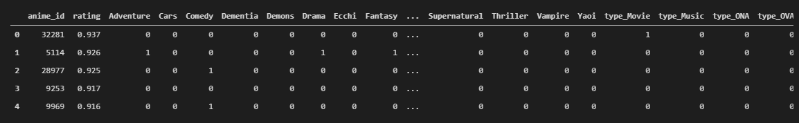
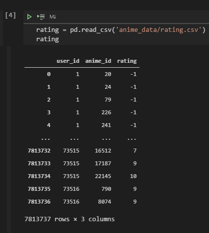
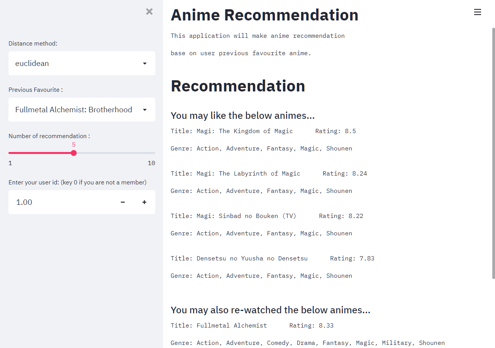

# Exercise-Streamlit_Anime_dataset

## Objective
This is an exercise to develop an anime recommendation system. Recommendation will be made base on user favourite anime, user_id and similarity distance measure method. Streamlit will be used for app framework.  

'Recommend_app(streamlit)' is code for the Streamlit ap.  
'Preprocessing' is code for the pre-processing on dataset.  

Data is from kaggle dataset: https://www.kaggle.com/CooperUnion/anime-recommendations-database

## Pre-processing on dataset 
There is two data file in the dataset.  

'Anime.csv' contain the information of the anime, including the anime_id, name of anime, genre, type, rating and number of episodes.  

'Rating.csv' records the anime that watched by the user and the rating. Rating is marked as '-1' if user did not rate the anime.  

Three data file prepared to develop the streamlit application. 

### anime.csv
Contain basic information of the anime. Indexed by 'anime_id', followed by the name, genre and rating.  

### anime_genre.csv
Data file generated from Anime.csv for similarity distance measure. Genre and type columns are One-Hot Encoded and rating is scaled to 0-1, indexed by 'anime_id'.  

### rating.csv
No preprocessing on this datafile. 

## Application
User are able to input the below for recommendation. 
- Distance method
- Previous favourite anime
- Number of recommendation wanted
- user_id 

## Result:
Recommendations will be displaced according to ascending order of the similarity distance to user favourite anime.  

Anime that haven't been watched will be on top.  

Suggestion for re-watch will be at the bottom.  

## Next Step:
1. User Input: 
    Instead of input favourite anime, application can be modified to input parameters of preferred genre for more flexibility on the recommendation on anime.  

2. Rating:
    A content-based recommendation is used in this application as the data file has detailed genre and type information of each anime. On the other hand, the data file for individual rating is not completed as a lot of the users didn't rate the anime that they have watched (with a lot of value '-1'). A collaborative filtering recommendation can be develop if a more detailed rating data obtained from the users in the future. 

